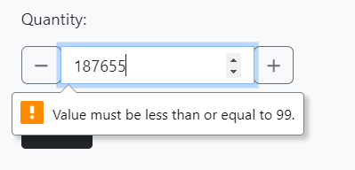

# Project 5 - La Selle 

La Selle is a fictitious bicycle saddle E-Commerce site created using the Django Framework and numerous other packages, libraries, modules and external tooling.
### View the site - [La Selle](https://la-selle-45cacae9f212.herokuapp.com/)
 

## Table of Contents

* [User Experience (UX)](#user-experience-ux)
  * [Initial Discussion](#initial-discussion)
  * [User Stories](#user-stories)
* [Design](#design)
  * [Wireframes](#wireframes)
  * [Database Schema](#database-schema)
  * [Features](#features)
* [Technologies Used](#technologies-used)
  * [Languages Used](#languages-used)
  * [Libraries & Programs Used](#libraries--programs-used)
* [Deployment & Local Development](#deployment--local-development)
* [Testing](#testing)
  * [Solved Bugs](#solved-bugs)
  * [Known Bugs](#known-bugs)
  * [Tesing User Stories](#testing-user-stories)
  * [Full Testing](#full-testing)
* [Credits](#credits)
* [Media](#media)
* [Acknowledgments](#acknowledgments)

## User Experience (UX)
### Initial Discussion
La Selle was created to accelerate product sales and create greater branding exposure for the saddle manufacturer "La Selle".  

### User Stories
A full list of user stories with documentation outlining the user stories and their respective storyboard can be found [here.](https://github.com/users/DavidUWL/projects/2/views/1?layout=table&pane=info) 
 
If the project README does not open, it can be accessed via the button below. 
 
 

## Design
Market research on other competitors in this domain has led me to a consistent color scheme/design that has roots in the product itself. A simple slightly rounded black and white page allows the products to be the centerpiece for catching the eye. As the products do not contain colour or straight corners, including either of these in the design would make the UX slightly jarring when moving across multiple products. Small uses of straight corners or colour allows the user to be strongly guided through the order and purchasing process. 

## Wireframes

  

  Click to expand homepage.
  

  
  * The homepage contains two main CTA's, including the discount banner and the button below the pages body tagline to view all products in the store. It will also contain functional elements like a navigation bar, and its associated search bar. All subsequent pages hereafter are extensions of this page minus the the body tagline and background image. 

 

 

  

  Click to expand all products page.
  

  * The all products page will render all products in the database and print their associated categories/ratings/price below. There will be a functional sort by element to sort the products by their dimensions. A back to top button will be in the bottom right which will bring the user back to the top of the page. 

 

  

  Click to expand product details page.
  

  
  * The product details page will contain the same product elements as the all products page, but include a description below, with a ratings section and size/quantity selectors. A simple CTA "buy" button will be below this. 

  

  Click to expand offcanvas sidebar cart.
  

  
  * If the shopping cart button is clicked, it will open an offcanvas element containing all the elements added to the cart during the users session. This will provide better UX for the customer instead of constant popups on the screen which may be distracting. A "checkout" CTA will be present. 

  

  Click to expand checkout cart page.
  

  
  * Similiar to the offcanvas shopping cart, all items in the user session will be rendered, with a second quantity selector and item prices. Below will be delivery/total/grand total. Two buttons below will take the user back to the products page, or continue to the checkout.  

  

  Click to expand checkout delivery and payment page.
  

  
  * The checkout will contain a form to submit the users shipping information, with a second render of the products added to the cart and the totals ect. Below will be a stripe payment section and a payment confirmation button.  

  

  Click to expand checkout success page.
  

  
  * The checkout success page will render two tables, containing the confirmed order and the delivery details. 

  

  Click to expand the user profile page.
  

  
   * The user profile will contain a form that allows the user to update or delete their shipping details, view their previous orders/ratings/product wishlist. 

## Database Schema 
A relational database was used for this project as it would best suit the needs of site. The schema below was created using [DbVisualiser.](https://www.dbvis.com/)  
_For more information on the User table/objects please refer to the_ [AllAuth Documentation.](https://docs.allauth.org/en/latest/index.html)
 

  

  Click to expand database schema.
  

_For a high res full table schema_ [click here](readme_images/schema/full_tables.svg)

## Color Palette 

* The color palette for this project was created to be quite minimalist and match the tones of the products being sold. A mix of bootstraps built in class colours were used lightly across elements to give them some extra pop on the page, however - generally, colour was kept to a minimum. 

## Typography 
The
[Orbitron](https://fonts.google.com/specimen/Orbitron?query=orbitron)
Google Font was used for the logo text in this project, suiting the minimalist design with its mixture of straight and rounded edges/cornering. Relying on a standard sans-Serif font as a backup if the Google font becomes unavailable.  
Bootstrap 5's "Native Font Stack" was used for the bread and butter text of the website as it is [dynamic based on the viewing device](https://getbootstrap.com/docs/5.0/content/reboot/#native-font-stack). 

## Features By Page
_Each Page feature section has been formatted as a dropdown for image tidiness, please click on them to expand the dropdown._
### Home page

  

  The home page's Navbar is dynamic based on the login state of the user. Users will not be able to view their profile or checkout until they are authenticated.
  

  
  
  
  

  

  Toasts will display depending on the actions of the user, providing dynamic success or error messages. 
  

  
  

  

  A product search bar has been included that will search both product name and its description for your keywords.
  

  

### Products

  

    The header bar present on each page is dynamic based on the highest discount value assigned to a product in the products table. If a product is added with a discount of 20% to the products table, this would be automatically reflected in the banner.  
    The banner can be clicked and will return only products that have discount values assigned to them.
  

  

  

    Products with discounts assigned to them will have their regular price and their calculated discount price displayed.  
    Each product has their Category/subcategory/technology rendered below the price along with the product rating.
    Each of these categories can be clicked and will return all products of the same tier. 
  

  

  

    A "return to top" button has been included in the general products page that will allow the user to return to the top of the page quickly. 
  

  

  

    A "Sort By" dropdown feature has been implemented to allow quicker searching by multiple product dimensions.
  

  

### Product details

  

  Authenticated users can leave a review of products, this is then stored in the database. 
  

  

  

    Product reviews are filtered and passed to a modified bootstrap carousel that will cycle each review. 
  

  

  

    A validated quantity selector has been added that will only allow quantities between 1 and 99. 
  

  

  

    A size selector has been added for products that may have multiple sizes. 
  

  

### Cart
  

  

    Users will only be able to click through to the checkout when authenticated.
  

  

  

    The users cart is stored in the browser session and will persist until session data has been cleared from the site. This setup prevents extra load being added to the database. 
  

  

  

    The cart page allows modifications of the users items in the cart, including adding or removing quantitys/items.
  

  

### Checkout
  

  

    Delivery details can be saved at the checkout, this will save to the users profile.
  

  

  

    Stripe payments have been integrated to the website, allowing both users and the site admins/owners to process their payments and orders with ease. 
  

  

  

    A custom spinner was implemented that occurs when the payment button has been clicked, this will be rendered until the stripe payment is complete. 
  

  

### Stripe Webhooks
Stripe webhooks were implemented in parallel with the payments integration. The webhook allows for added failsafes to payments when communication issues may arise, or database errors caused at the time of payment.  
A webhook provides direct feedback from the stripe API that a payment has been completed or failed leading to faster response times to orders or issues.  
The webhook response can also be used to trigger event specific functions like triggering an order confirmation email for a customer. 

  

    Click to expand Local webhook.
  

  

  

    Click to expand Local webhook order details.
  

  

  

    Click to expand deployed webhook.
  

  

  

    Click to expand deployed webhook order details.
  

  

### Accounts

  

    The Allauth package has been used for user authentication and verification, their templates have been modified to suit the styling of the site. 
  

  

### Profiles
  

  

    The user profile has been created with a modular setup in mind, allowing sections to be easily added in the future. 
  

  

  

    The orders card will open a modal that returns all orders that a user has made, hyperlinking to their checkout success page, detailing their order details. This is ordered by most recent date for better UX. The table also takes into account overflow and will be scrollable depending on the amount of orders the user has made previously. 
  

  

  

    The ratings card will return all reviews that a user has made in a table similiar to the order history modal. It also contains a switch that enable deletions if the user would like to remove their ratings. This is disabled by default to prevent users from deleting their reviews accidently. 
  

  

  

    The users shipping details can be created/save and delete from their profile. These details will autofill when a user is at the checkout page. 
  

  

### Emails
Gmail was used for the deployed site as an SMTP server for sending emails to customers for both account related information and for order confirmations. The setup documentation for this can be found [here.](https://support.google.com/a/answer/176600?hl=en)

  

    Users will be sent an email on signup to verify their account via a unique URL (Account verifcation is disabled for this project - the  email is still sent however.)
  

  

  

    Users will receive an order confirmation email containing a brief description of their shipping details and total costs.
  

  

### Defensive Design
* Users must be validated to access any part of the site that requires authentication, including the cart/checkout/profile pages.  
* A custom 404 page has been implemented that will be returned if any page/records cannot be found.
 
 

* User input fields have either custom validation written for values, or inherited required status from their database models. 

### Future Implentations
1. A user story has already been included into the user story backlog, i would like the super-user to have a dedicated front end page that allows them to add products to the database when needed. Currently the user is able to do this via the admin panel, however i would prefer it to be contained within the frontend of the site with site branding + colouring ect. 
2. In tandem with the user reviews, i would like a numbered rating system that is submitted alongside this. The product ratings would then be amalgamated to form the ratings average for each product instead of being submitted by the super-user when the product is created. 
3. A product wishlist implented onto each product and saved to the users profile, this could then be retrieved via the profile page. 

## Technologies Used

### Languages & Packages Used 
 
 
 
    

* packages/Frameworks/Libraries:
  * Django Framework - A Full Stack Python web framework.
  * Bootstrap - A framework designed for responsive + rapid web design.
  * Jquery - A javascript library used for DOM manipulation. **
  * Font Awesome - A CDN For iconography.
  * AllAuth - Used for User authentication and registration.
  * Gunicorn - A Python WSGI HTTP server that aids in deployment.
  * psycopg2-binary - A postgreSQL adapter for Python. 
  * dj-database-url - For parsing the hosted SQL server URL. 
  * Stripe - For secure integrated payment systems.
  * S3transfer - For backend configuration of the AWS s3 Bucket.
  * python-dotenv - Used for .env variable imports. 
  * Crispy forms - For quicker/easier form styling. 
 

** _As of Bootstrap v5, jquery is no longer required._

## Database tools
* The development environment used the inbuilt SQLite3 database. 
* PostgreSQL and an externally hosted SQL Server by 
[ElephantSQL.](https://www.elephantsql.com/docs/index.html)
### Programs Used
* Github was used as a repository to store website files and code. 
* Amazon AWS s3 was used for image storage and serving images. 
* Gitpod used as the coding environment with git for version control.
* Balsamic For wireframes. 
* Google Dev tools for development and testing responsiveness. 
* [DbVisualiser.](https://www.dbvis.com/) 
  for creating the Database Schema's. 
* [Site Palette](https://chromewebstore.google.com/detail/site-palette/pekhihjiehdafocefoimckjpbkegknoh?hl=en-GB)
  to create the website colour palette image. 

## Deployment and Local Development

Please refer to [the deployment document](DEPLOYMENT.md) for relevant information on deployment and local development. 

## credits
### Content
All content for this website was created by me - David Kirby. 

## Media
[Istockphoto for the homescreen/background image.](https://www.istockphoto.com/)

 
## Acknowledgments
[Derek Mcauley](https://github.com/derekmcauley7) For his guidance as my Code Institute mentor.  
[Kera cudmore](https://github.com/kera-cudmore/readme-examples/blob/main/milestone1-readme.md) For her fantastic README template.
