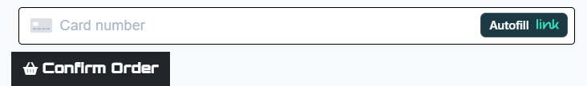

# Project 5 - La Selle 


La Selle is a fictitious bicycle saddle E-Commerce site created using the Django Framework and numerous other packages, libraries, modules and external tooling.
### View the site - [La Selle](https://la-selle-45cacae9f212.herokuapp.com/)
<br>

## Table of Contents

* [User Experience (UX)](#user-experience-ux)
  * [Initial Discussion](#initial-discussion)
  * [User Stories](#user-stories)
* [Design](#design)
  * [Wireframes](#wireframes)
  * [Database Schema](#database-schema)
  * [Features](#features)
* [Technologies Used](#technologies-used)
  * [Languages Used](#languages-used)
  * [Libraries & Programs Used](#libraries--programs-used)
* [Deployment & Local Development](#deployment--local-development)
  * [Deployment](#deployment)
* [Testing](#testing)
  * [Solved Bugs](#solved-bugs)
  * [Known Bugs](#known-bugs)
  * [Tesing User Stories](#testing-user-stories)
  * [Full Testing](#full-testing)
* [Credits](#credits)
* [Media](#media)
* [Acknowledgments](#acknowledgments)

## User Experience (UX)
### Initial Discussion
La Selle was created to accelerate product sales and create greater branding exposure for the saddle manufacturer "La Selle".  
 

### User Stories
A full list of user stories with documentation outlining the user stories and their respective storyboard can be found [here.](https://github.com/users/DavidUWL/projects/2/views/1?layout=table&pane=info) 
<br>
If the project README does not open, it can be accessed via the button below. 
<br>
 


## Design
Market research on other competitors in this domain has led me to a consistent color scheme/design that has roots in the product itself. A simple slightly rounded black and white page allows the products to be the centerpiece for catching the eye. As the products do not contain colour or straight corners, including either of these in the design would make the UX slightly jarring when moving across multiple products. Small uses of straight corners or colour allows the user to be strongly guided through the order and purchasing process. 

## Wireframes

<details>
  <summary>
  Click to expand homepage.
  </summary>

 
</details> 
<details>
  <summary>
  Click to expand all products page.
  </summary>


</details> 
<details>
  <summary>
  Click to expand product details page.
  </summary>
  

</details>
<details>
  <summary>
  Click to expand offcanvas sidebar cart.
  </summary>
  

</details>
<details>
  <summary>
  Click to expand checkout cart page.
  </summary>
  

</details>
<details>
  <summary>
  Click to expand checkout delivery and payment page.
  </summary>
  

</details>
<details>
  <summary>
  Click to expand checkout success page.
  </summary>
  

</details>
<details>
  <summary>
  Click to expand the user profile page.
  </summary>
  

</details>


## Database Schema 
A relational database was used for this project as it would best suit the needs of site. The schema below was created using [DbVisualiser.](https://www.dbvis.com/) <br>
_For more information on the User table/objects please refer to the_ [AllAuth Documentation.](https://docs.allauth.org/en/latest/index.html)
<br>
<details>
  <summary>
  Click to expand database schema.
  </summary>


_For a high res full table schema_ [click here](readme_images/schema/full_tables.svg)
</details>


## Color Palette 

* The color palette for this project was created to be quite minimalist and match the tones of the products being sold. A mix of bootstraps built in class colours were used lightly across elements to give them some extra pop on the page, however - generally, colour was kept to a minimum. 

## Typography 
The
[Orbitron](https://fonts.google.com/specimen/Orbitron?query=orbitron)
Google Font was used for the text in this project, suiting the minimalist design with its mixture of straight and rounded edges/cornering. Relying on a standard sans-Serif font as a backup if the Google font becomes unavailable. <br>
Bootstrap 5's "Native Font Stack" was used for the bread and butter text of the website as it is [dynamic based on the viewing device](https://getbootstrap.com/docs/5.0/content/reboot/#native-font-stack). 

## Features By Page
_Each Page feature section has been formatted as a dropdown for image tidiness, please click on them to expand the dropdown._
### Home page
<details>
  <summary>
  The home page's Navbar is dynamic based on the login state of the user. Users will not be able to view their profile or checkout until they are authenticated.
  </summary>

  
  
  
  
</details>

<details>
  <summary>
  Toasts will display depending on the actions of the user, providing dynamic success or error messages. 
  </summary>

  
  
</details>

<details>
  <summary>
  A product search bar has been included that will search both product name and its description for your keywords.
  </summary>

  
</details>

<hr>

### Products

<details>
  <summary>
    The header bar present on each page is dynamic based on the highest discount value assigned to a product in the products table. If a product is added with a discount of 20% to the products table, this would be automatically reflected in the banner. <br>
    The banner can be clicked and will return only products that have discount values assigned to them.
  </summary>

  
</details>

<details>
  <summary>
    Products with discounts assigned to them will have their regular price and their calculated discount price displayed. <br>
    Each product has their Category/subcategory/technology rendered below the price along with the product rating.
    Each of these categories can be clicked and will return all products of the same tier. 
  </summary>

  
</details>

<details>
  <summary>
    A "return to top" button has been included in the general products page that will allow the user to return to the top of the page quickly. 
  </summary>

  
</details>

<details>
  <summary>
    A "Sort By" dropdown feature has been implemented to allow quicker searching by multiple product dimensions.
  </summary>

  
</details>
<hr>

### Product details

<details>
  <summary>
  Authenticated users can leave a review of products, this is then stored in the database. 
  </summary>

  
</details>

<details>
  <summary>
    Product reviews are filtered and passed to a modified bootstrap carousel that will cycle each review. 
  </summary>

  
</details>

<details>
  <summary>
    A validated quantity selector has been added that will only allow quantities between 1 and 99. 
  </summary>

  
</details>

<details>
  <summary>
    A size selector has been added for products that may have multiple sizes. 
  </summary>

  
</details>

<hr>

### Cart

<details>
  <summary>
    Users will only be able to click through to the checkout when authenticated.
  </summary>

  
</details>

<details>
  <summary>
    The users cart is stored in the browser session and will persist until session data has been cleared from the site. This setup prevents extra load being added to the database. 
  </summary>

  
</details>

<details>
  <summary>
    The cart page allows modifications of the users items in the cart, including adding or removing quantitys/items.
  </summary>

  
</details>

<hr>

### Checkout

<details>
  <summary>
    Delivery details can be saved at the checkout, this will save to the users profile.
  </summary>

  
</details>

<details>
  <summary>
    Stripe payments have been integrated to the website, allowing both users and the site admins/owners to process their payments and orders with ease. 
  </summary>

  
</details>

<hr>

### Accounts

<details>
  <summary>
    The Allauth package has been used for user authentication and verification, their templates have been modified to suit the styling of the site. 
  </summary>

  
</details>

<hr>

### Profiles

<details>
  <summary>
    The user profile has been created with a modular setup in mind, allowing sections to be easily added in the future. 
  </summary>

  
</details>

<details>
  <summary>
    The orders card will open a modal that returns all orders that a user has made, hyperlinking to their checkout success page, detailing their order details. This is ordered by most recent date for better UX. The table also takes into account overflow and will be scrollable depending on the amount of orders the user has made previously. 
  </summary>

  
</details>

<details>
  <summary>
    The ratings card will return all reviews that a user has made in a table similiar to the order history modal. It also contains a switch that enable deletions if the user would like to remove their ratings. This is disabled by default to prevent users from deleting their reviews accidently. 
  </summary>

  
</details>

<details>
  <summary>
    The users shipping details can be created/save and delete from their profile. These details will autofill when a user is at the checkout page. 
  </summary>

  
</details>

<hr>

### Emails

<details>
  <summary>
    Users will be sent an email on signup to verify their account via a unique URL (Account verifcation is disabled for this project - the  email is still sent however.)
  </summary>

  
</details>

<details>
  <summary>
    Users will receive an order confirmation email containing a brief description of their shipping details and total costs.
  </summary>

  
</details>


<hr>

### Defensive Design
* As mentioned above, users will not be able to access certain pages of the website without being authenticated. With both a mix of the dynamic navbar and Django's templating language, the option will not be given to the user - but if the URL is entered manually the user will be prompted to sign in or register regardless. 
<hr>

### Table Automation 

```python 
def get_available_table(selected_date, selected_time, covers):
    available_tables = Table.objects.filter(table_covers__gte=covers)
    
    for table in available_tables:
        if not Reservation.objects.filter(table=table, date=selected_date, time=selected_time).exists():
            return table

    return None  # No available table found

``` 

* Within the view, a function was created that will return all values from "Table" which have been pre-created using a [management command](#management-command). The function will then take the date and time and check whether a record with the provided parameters exists. If it does not exist it will assign a table, if it is unable to find a table it will return nothing. 
<hr>

#### Management Command 
```python
class Command(BaseCommand):
    help = 'Creates tables with table number and covers.'

    def handle(self, *args, **kwargs):
        tables = [
            Table(table_number=1, table_covers=1),
            Table(table_number=2, table_covers=1),
            Table(table_number=3, table_covers=1),
            Table(table_number=4, table_covers=1),
            Table(table_number=5, table_covers=1),
            Table(table_number=6, table_covers=2),
            Table(table_number=7, table_covers=2),
            Table(table_number=8, table_covers=4),
            Table(table_number=9, table_covers=4),
            Table(table_number=10, table_covers=4)
        ]

        for table in tables:
            table.save()

        self.stdout.write(self.style.SUCCESS('Successfully created 10 Table objects.'))
```

* A management command was created that would allow the restaurant to modify their table number and covers as needed for the table automation. 
<hr>

### Future Implentations
* For this project, as emails were made optional for signup, i deemed the email booking as not having enough value to implement on this epic. However, i do want to implement this in the future and make validated emails mandatory on signup.
* I would like to refactor the table automation so that larger tables do not get occupied by small cover numbers EG 1 person at a table that could seat 4. 
* I would like to redesign the navbar for mobile devices so that a sidebar overlay is used instead of a dropdown as some elements overlay over the dropdown nav element. 
* I would like to create a seating system that uses the table objects as a primary key to create an all in one system that owner managers could use to have a granular view of their tables daily (similar to the restaurant's view in opentable). 
* I Would like to implement some basic query functions in the admin panel that would allow the owner to query their reservations in the front end based on dynamic criteria EG: name, Date, covers ect. 

## Technologies Used

### Languages & Packages Used 
Languages HTML, CSS, Python.  

* packages/Frameworks/Libraries:
  * Django Framework - A Full Stack Python web framework.
  * Bootstrap - A framework designed for responsive + rapid web design.
  * Jquery - A javascript library used for DOM manipulation. **
  * Font Awesome - A CDN For iconography.
  * AllAuth - Used for User authentication and registration.
  * White Noise - used for deployment to Heroku and serving static files. 
  * Gunicorn - A Python WSGI HTTP server that aids in deployment.
  * psycopg2-binary - A postgreSQL adapter for Python. 
  * django-money - See below.
  * python-decouple - See below.
  * dj-database-url - For parsing the hosted SQL server URL. 
<br>

** _As of Bootstrap v5, jquery is no longer required._

### Package notes


* [python-decouple](https://pypi.org/project/python-decouple/) was used during the development of this project to experiment with the separation of configuration settings and code. It also made it easier to carry out version control by having confidence that my environment variables were not exposed. 
```python
    else:
        DATABASES = {
            'default': dj_database_url.parse(config('DATABASE_URL'))
        }
```

* [django-money](https://pypi.org/project/django-money/) is a cool package that allows distinct configuration for Django model fields that will contain currencies. When the currency is defined, the corresponding symbol will be rendered.  
  * This package also allows for records in the same column to return with multiple currency symbols which can be chosen from by simply importing the package.  

```python
price = MoneyField(max_digits=14, decimal_places=2, default_currency='EUR')
```


## Database tools
* The development environment used the inbuilt SQLite3 database. 
* PostgreSQL and an externally hosted SQL Server by 
[ElephantSQL.](https://www.elephantsql.com/docs/index.html)
### Programs Used
* Github was used as a repository to store website files and code. <br>
* Gitpod used as the coding environment with git for version control. <br>
* Balsamic For wireframes. 
* Google Dev tools for development and testing responsiveness. 
* [Figma](https://www.figma.com/files/recents-and-sharing?fuid=1308151216497747353) 
  for creating the Database Schema. 


## Deployment & Local Development

### Deployment
#### ElephantSQL provided the hosting and backend for our SQL database.<br>
The database can be created by the following: <br>
  1. Create a new instance in your ElephantSQL dashboard, this can be found in the top right.
  2. Give your instance a name and choose the region closest to you.
  3. Click create instance in the bottom right.
  4. Copy the URl from your dashboard for the new database. 

#### Heroku Provided the web hosting for our application.
The Heroku App can be created by the following: <br>
  1. From your Heroku Dashboard, click "new" in the top right and create a new app.
  2. Give your App a unique name and click Create App. 
  3. Once created, open the app settings and select config var - create a new variable called `DATABASE_URL` and give it the value of the ElephantSQL URL you copied in step 4 previously.
  
#### Preparing your Workspace for Deployment
  1. install dj_database_url and psycopg2 .
  ```python
  pip3 install dj_database_url psycopg2 gunicorn whitenoise
  ```
  2. update your requirements.txt file to reflect your new installs.
  ```python
  pip3 freeze > requirements.txt 
  ```
  3. In my case, i had to add the following line to my requirements.txt due to the version of python/packages installed to allow heroku to deploy: 
  ```python
  backports.zoneinfo==0.2.1;python_version<"3.9"
  ```
  4. Open your .env file and insert your `DATABASE_URL` variable and its URL value(From step 4 in ElephantSQL steps).
  5. In settings.py Under your OS import - write `import dj_database_url`.
  6. Find your DATABASES variable in settings.py and comment it out, replacing it with the below: 
  ```python 
  DATABASES = {
    'default': dj_database_url.parse(os.environ.get('DATABASE_URL'))
  }
  ```
  7. Run your server from the terminal to verify your database connection with `python3 manage.py runserver`

  8. Create your superuser with the terminal command : `python3 manage.py createsuperuser`
  9. View your new superuser within elephant SQL by querying the auth_user table. 
  10. modify your database pointers in settings.py to the below:
  ```python
  if DEBUG:
      DATABASES = {
      'default': {
      'ENGINE': 'django.db.backends.sqlite3',
      'NAME': os.path.join(BASE_DIR, 'db.sqlite3'),
          }
        }
  else:
      DATABASES = {
          'default': dj_database_url.parse(os.environ.get('DATABASE_URL'))
      }
  ```
  11. If your `DEBUG` variable in settings.py is set to `True` you will now use the SQLite database for developement, if false you will be working with the deployed database.
  12. Create a `Procfile` (capital P) in your root directory and add the below line of code to serve your app via gunicorn: 
  ```python
  web: gunicorn YOUR_APP_NAME.wsgi:application
  ``` 
  13. Add the below code into your middleware config in settings.py to configure `whitenoise` and allow it to serve your static files to Heroku: 
  ```python
  MIDDLEWARE = [
    # ...
    "django.middleware.security.SecurityMiddleware",
    "whitenoise.middleware.WhiteNoiseMiddleware",
    # ...
  ]
  
  STATICFILES_STORAGE = "whitenoise.storage.CompressedManifestStaticFilesStorage"
  ```

  14. add the below code to your allowed hosts and modify the Heroku URL to your deployed URL: 
  ```python
  if DEBUG:
    ALLOWED_HOSTS = ['8000-daviduwl-project4-jwzitk3c01w.ws-eu106.gitpod.io']
  else: 
    ALLOWED_HOSTS = ['therestaurant-ec18b29952b2.herokuapp.com']
  ``` 
  15.  Enable Automatic deployments on Heroku within the deploy section of your app. Connect via your GitHub credentials and search for your current working repo and connect, you will now be able to select automatic deployments below. 
  16. Save your current changes and add a commit message and push to GitHub.

## Forking/Cloning 
To create a fork for this repository: 
* Navigate to the url - https://github.com/DavidUWL/Project-4
  * In the top right corner, click on the Fork dropdown. 
  * Create a new fork
  * Name the repository and/or give it a description - Click create fork. 
* You have now created a fork of this repository! 
To create a clone of this repository:
* Navigate to the url - https://github.com/DavidUWL/Project-4
  * Click on the "code" button and select which format you would like to clone with and copy that link.
  * In your Terminal window of whichever IDE you use, navigate to the whichever directory you want to clone the project to. 
  * type into the terminal "git clone", you have now cloned the project! 


## Testing
Testing for this project was ongoing throughout, Using predominantly manual testing in conjunction with Google Dev Tools emulating multiple viewports. Once the database had taken shape and logic was in place, unit testing was then implemented in parallel while development continued.   

## Validation Testing 
The W3C validator was used to validate all HTML pages on this site and also used to validate the CSS. 
<hr> 

### HTML 

| Page | Result |
| :--- | :--- |
| Home Page | Pass |     
| View Booking | Pass |     
| Amend Booking | Pass |    
| Cancel Booking | pass | 
| Menu | pass |       
| Reserve Success | pass |
| log in | pass |
| Log Out | Pass | 
| sign up | pass | 
<hr>

### CSS 
style.CSS file in static directory has passed W3C with no errors. 
<p>
    <a href="http://jigsaw.w3.org/css-validator/check/referer">
        
    </a>
</p>

### python
All python code adheres to pep 8 standards. Some lines are viewed as too long, however stylistically they would be harder to read if not in a uniform code block or across multiple lines.

## Automated Unit Testing
Unit testing was used in this project once the database and the models were up and running. There is a variable in the `settings.py` file called `TESTING`, this value needs to be set to `True` in conjunction with `DEBUG` to run the tests on the SQLite database as the test will not run against the postgreSQL database due to external factors. 

Unit tests can be found [here.](https://github.com/DavidUWL/Project-4/blob/main/therestaurant/tests.py)
* The first test case: `ReservationQuerySetTests` simulates a table being assigned automatically when a form is submitted to test the `reserve_table()` function is working correctly. 
* The second test case: `ReservationViewTest` simulates an authenticated user making a booking and verifies whether the reservation is written to the database correctly and redirects to the success page. 

### Solved Bugs
* A bug was experienced when deploying to Heroku where the build wheels for the `backports.zoneinfo` package could not be built. A solution was given on [stack overflow](https://stackoverflow.com/questions/71712258/error-could-not-build-wheels-for-backports-zoneinfo-which-is-required-to-insta) by user [ayandebnath](https://stackoverflow.com/users/13618361/ayandebnath) to modify the requirements.txt file to include the line which resolved the issue:
```python
backports.zoneinfo;python_version<"3.9"
```

* A bug with the footer being pushed off the bottom of the page was encountered, this was being caused by incorrectly giving the container a class of table-responsive, which is not in use with bootstrap 5. 

### known/unresolved bugs 
* There is a known bug with specifically very small width viewports that causes the tables to push the footer off the end of the page by 80px depending on the amount of values entered. This is caused by the `main {padding-top: 80px;}` and will be resolved in a future release that refactors the navbar into a sidebar overlay. 

### Complications
Many complications were experienced when creating this project, whether it be with code or with the deployment itself. I would typically not deem complications a "bug" until the code has become live and deployed into the wild, prior to this - its simply unimplemented code. If the developer needs to move on, i can see the need for bug tracking at this point - however i did not experience any complications that took a substantial amount of time from the rest of the project. 


### Testing User Stories 
All user stories would require their tasks completed before testing their acceptance. 
| #ID  | Acceptance | Notes if Required
| :--- | :--- | :---: 
|[#1](https://github.com/users/DavidUWL/projects/1?pane=issue&itemId=45210713) | PASS |
|[#2](https://github.com/users/DavidUWL/projects/1?pane=issue&itemId=37884010) | PASS |
|[#3](https://github.com/users/DavidUWL/projects/1?pane=issue&itemId=37884008) | PASS |
|[#4](https://github.com/users/DavidUWL/projects/1?pane=issue&itemId=37884007) | PASS |
|[#5](https://github.com/users/DavidUWL/projects/1?pane=issue&itemId=37884005) | PASS |
|[#6](https://github.com/users/DavidUWL/projects/1?pane=issue&itemId=37884003) | not implemented | May be implemented in the future.
|[#7](https://github.com/users/DavidUWL/projects/1?pane=issue&itemId=37884002) | PASS |
|[#8](https://github.com/users/DavidUWL/projects/1?pane=issue&itemId=37884000) | PASS | Owner can view all bookings in admin panel.
|[#9](https://github.com/users/DavidUWL/projects/1?pane=issue&itemId=37883995) | PASS |
|[#10](https://github.com/users/DavidUWL/projects/1?pane=issue&itemId=37883993) | PASS |
|[#11](https://github.com/users/DavidUWL/projects/1?pane=issue&itemId=37883988) | PASS | Owner can modify each booking field in admin panel once a reservation is made.


## credits
### Content
All content for this website was created by me - David Kirby. 

## Media
[Istockphoto for the homescreen/background image.](https://www.istockphoto.com/)

 
## Acknowledgments
[Derek Mcauley](https://github.com/derekmcauley7) For his guidance as my Code Institute mentor. <br>
[Kera cudmore](https://github.com/kera-cudmore/readme-examples/blob/main/milestone1-readme.md) For her fantastic README template.
